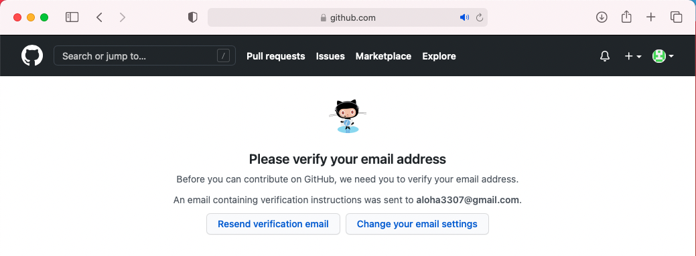
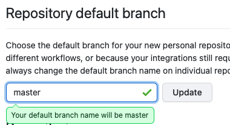
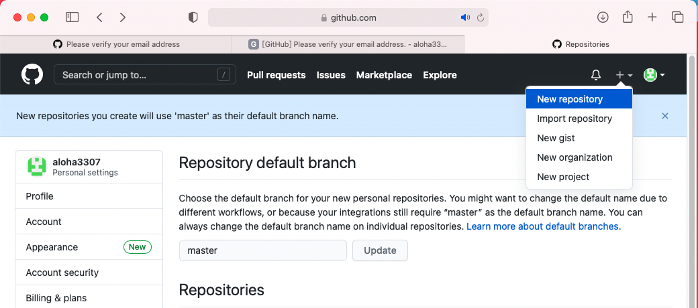
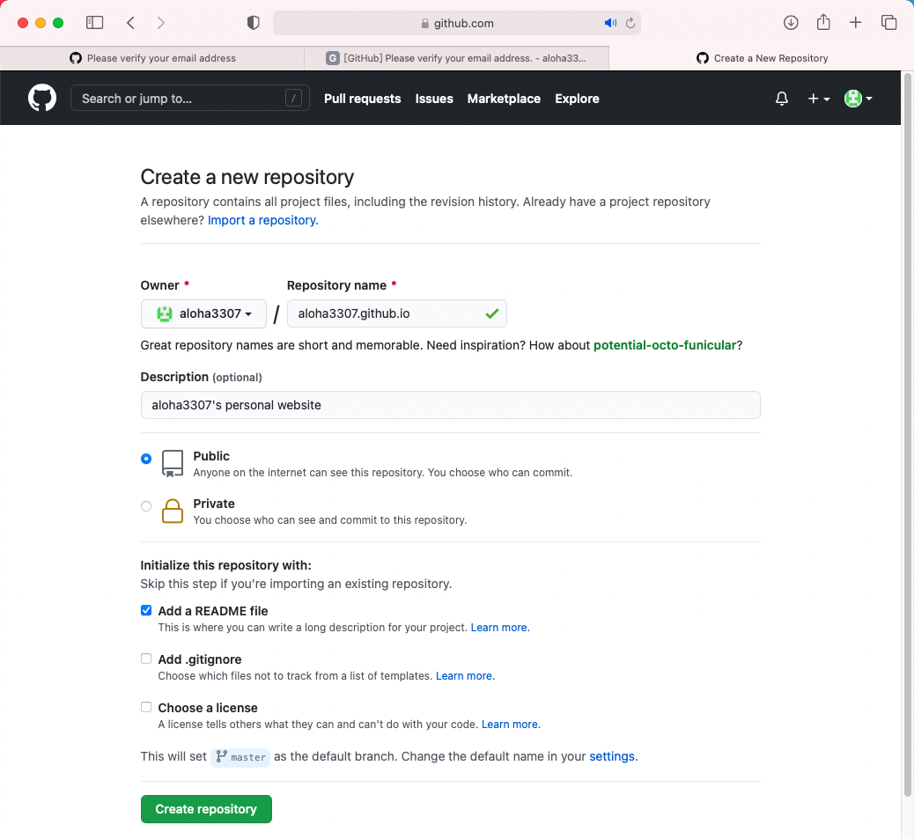

# 在 Github 創建新帳號並新增 Repo(儲存庫)

-----

### 教程大綱 :
1. 在 Github 創建新帳號
2. 在 Github 設定 Repo 的主分支名稱
3. 在 Github 新增一個 Repo 預定用來作個人網頁空間

-----

### 在 Github 創建新帳號 :
1. 開啟瀏覽器 在網址列輸入 https://github.com 進到 github網站 然後按右上角的 "Sign up"

2. 輸入自訂的帳號密碼、可以收信的email信箱、完成裡面的驗證後按 "Create Account" (創建帳號)

3. 按下 Create Account 後，頁面會轉到 Welcome Github，點選頁面的選項(這邊可依自己興趣點選) 然後按最下方的 "Complete setup" (完成設定)

4. 網頁訊息提示我們該去驗證email，接著開啟申請時填寫的email信箱，會看到裡面有一封github寄來的信，將它開啟點裡面的 "Verify email address" 就完成email驗證程序，現在你已經有一個github帳號可以使用了!

-----

### 在 Github 設定 Repo 的主分支名稱 :

1. 點右上角的帳號小圖 在下拉選單按下 Settings

2. 點一下左側的Reposities 再將 Repository defalut branch 欄位內容 main 更改為 master 完成按下 Update

-----

### 在 Github 新增一個 Repo 預定用來作個人網頁空間 :
1. 按右上角的 [＋] 點選 New repository

2. 在 Repository name 輸入 帳號.github.io (例如我的帳號是 aloha3307 我就輸入 aloha3307.github.io 在這裡要特別留意不能打錯 打錯就會沒辦法用github來作個人網頁空間 ) 其它的按參考圖設置即可 所有設置完成後按一下最下方的 Create repository (建立儲存庫)

3. 按下 Create repository 後，頁面會轉到新建的repository頁面，看到下面的畫面表示儲存庫已經成功新增了!

4. 開啟一個網頁瀏覽器 在網址列輸入 帳號.github.io (例如我的首頁網址是 aloha3307.github.io)然後按Enter，會看到網頁內容已經可以正常顯示了! (稍後我們會用 Git 及 本機cmd命令 來更新 github 空間的內容)

