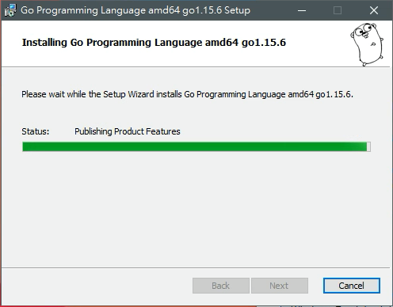

# 從官網下載安裝 Golang 程式並簡單測試能否執行

-----

###  從 Golang 官網下載最新安裝程式並安裝:

1. 從 Google 搜尋 'golang' 點官網連結 golang.org

2. 在 Python 官網 點 Download Go

3. 點 [ Microsoft Windows ] 稍等一會兒會看到左下角正在下載安裝程式

4. 安裝程式下載完成會在網頁左下角看到  直接點它選開啟

5. golang 的安裝只需要一直點下一步就完成了

-----

### 簡單測試是否能執行 Golang :

1. 按[Win]+[R]開啟 執行 小視窗，然後在裡面輸入 cmd 再按[enter] 開啟DOS視窗(簡稱cmd)

2. 在 cmd 裡直接輸入 go version 如果已經安裝成功的話 會看到 go 的版本畫面

-----